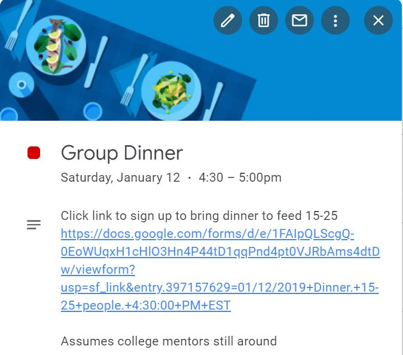

# Group Meal Signups
## Overview
Group Meal Signups is a Javascript project that works with Google APIs to allow a team signup mechanism for meals.
First, a Google Calendar is set up that will contain all team meals.
Using Google Forms, the group organizer can create meals in the calendar.
An empty meal form has a date, type (lunch or dinner), start time, number of people to feed, special description, color, and, most importantly, a URL to sign up for that meal. If the organizer accidentally creates two of the same meal, the event will not be added to the calendar and a conflict email will be sent.
When the calendar event is clicked on, the description displays all that information.
The URL brings the user to a Google Form.

  
Calendar meal with link for signup

In the Google Form, the prospective volunteer enters their name, contact info, student name (for chaperoning parents), meal chosen (clicked URL  filled in by default), a description of the food to bring, and allergen alerts. The volunteer doesn't have the option of signing up for a meal that has been signed up for already (except in rare circumstance that forms for same meal submitted within seconds of each other). Once submitted, the description and color on the Google Calendar will change to reflect the submitted information.

When a volunteer signs up for a meal, they will immediately receive a confirmation email. This will reiterate the information they just put into the form. In addition, the volunteer will receive an email reminder with the same information before their scheduled meal time (2 days by default). In the rare case that a conflict arises due to code overload from simultaneous submitted forms, the volunteer will receive a conflict email.

All the data is stored in one Google Sheet. That sheet has a checkbox that updates the calendar with any new information in case the owner wants to clean it up. The spreadsheet, except for deleting events, should not need to be used after set-up is complete.

## Necessary Setup
1. Have (1) meal organizer complete all the following steps
2. Create a Google Sheet (for master data). Name it something to recognize it as the master data set
3. Create a Google Form and name it "(Organization) Group Meal Entry" (name not critical).  
    **Order is important**  
    a. Add a *REQUIRED* date field titled "Date"  
    b. Add a *REQUIRED* multiple choice question titled "Meal Options" with answers "Lunch" and "Dinner"  
    c. Add a *REQUIRED* time field titled "Approximate Delivery Time"  
    d. Add a *REQUIRED* short-answer question titled "People to Feed Estimate"  
    e. Add a short-answer question titled "Special Details"  
    f. Add a *REQUIRED* short-answer question titled "Email Address"  
    g. Go to RESPONSES, click on green and white Sheets logo  
    h. Link the form to the Sheet created in Step (2)  
4. In Google Sheet, rename the new response sheet "Group Meal Creation" by right-clicking it on the bottom of the screen  
5. Delete Sheet1 (default sheet) by right-clicking it on the bottom of the screen  
6. Create a Google Form and name it "(Organization) Group Meal Signup"  
   **Order is important**  
   a. Add a label with title "Contact Info" and subtitle "Reminders will be sent to email"  
   b. Add a *REQUIRED* short-answer question titled "Name"  
   c. Add a *REQUIRED* short-answer question titled "Email"  
   d. Add a short-answer question titled "Phone Number"  
   e. Add a short-answer question titled "Student Name" (or other affiliation identifier)  
   f. Add a label with title "Volunteering Details"  
   g. Add a *REQUIRED* multiple choice question titled "Meal Options (choose "No Change" if editing response)"  
      i. The options will be filled in by the program, so add no options to start  
   h. Add a long-answer question titled "Food Description"  
   i. Add a long-answer question titled "Allergen Alerts"  
   j. Go to RESPONSES, click on green and white Sheets logo  
   k. Link the form to the Sheet created in Step (2)  
7. In Google Sheet, rename the new response sheet "Group Meal Signup" by right-clicking it on the bottom of the screen  
8. Click Add Sheet button (+) in bottom left of Google Sheet  
   a. Name sheet "Group Meal Master"  
   b. Fill A1 with "Date"  
   c. Fill B1 with "Meal"  
   d. Fill C1 with "Approximate Delivery Time"  
   e. Fill D1 with "People to Feed Estimate"  
   f. Fill E1 with "Special Details"  
   g. Fill F1 with "Provider Name"  
   h. Fill G1 with "Provider Email"  
   i. Fill H1 with "Provider Phone"  
   j. Fill I1 with "Provider Student Name" (or other affiliation identifier)  
   k. Fill J1 with "Food Description"  
   l. Fill K1 with "Allergen Alerts"  
   m. Fill L1 with "Event ID"  
   n. Fill M1 with "Trigger ID"  
   o. Fill N1 with "Form ID"  
   p. Fill O1 with "Check Below to Update"
   q. Click on O2. Click on Insert-> Checkbox  
9. Ensure the sheets are in order. If not drag to reorder. From left to right:  
   1. "Group Meal Signup"  
   2. "Group Meal Creation"  
   3. "Group Meal Master"  
10. 

## Setup Extra Options
Google Calendar colors
Google Calendar notifications/auto-emails (allows guarantee in large-scale use)
Reminder email time before
Breakfast, snack
Change description on calendar from student name to 

## User Use

## Limitations
Size if email reminder important due to triggers
Manual deletion of event necessary, no email reminder if event deleted
Initial entry time-consuming
Real-time email conflict signup buggy
Triggers could add up, needs to be cleaned occasionally
